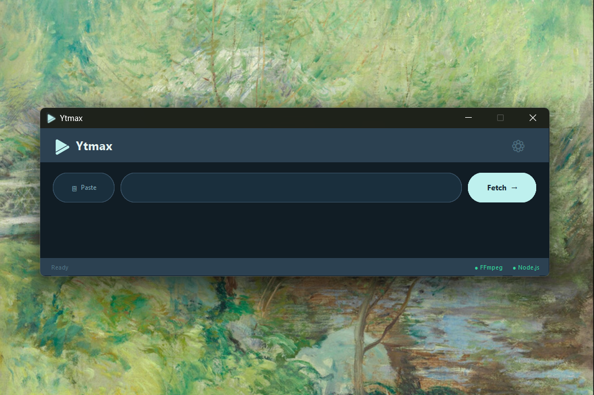
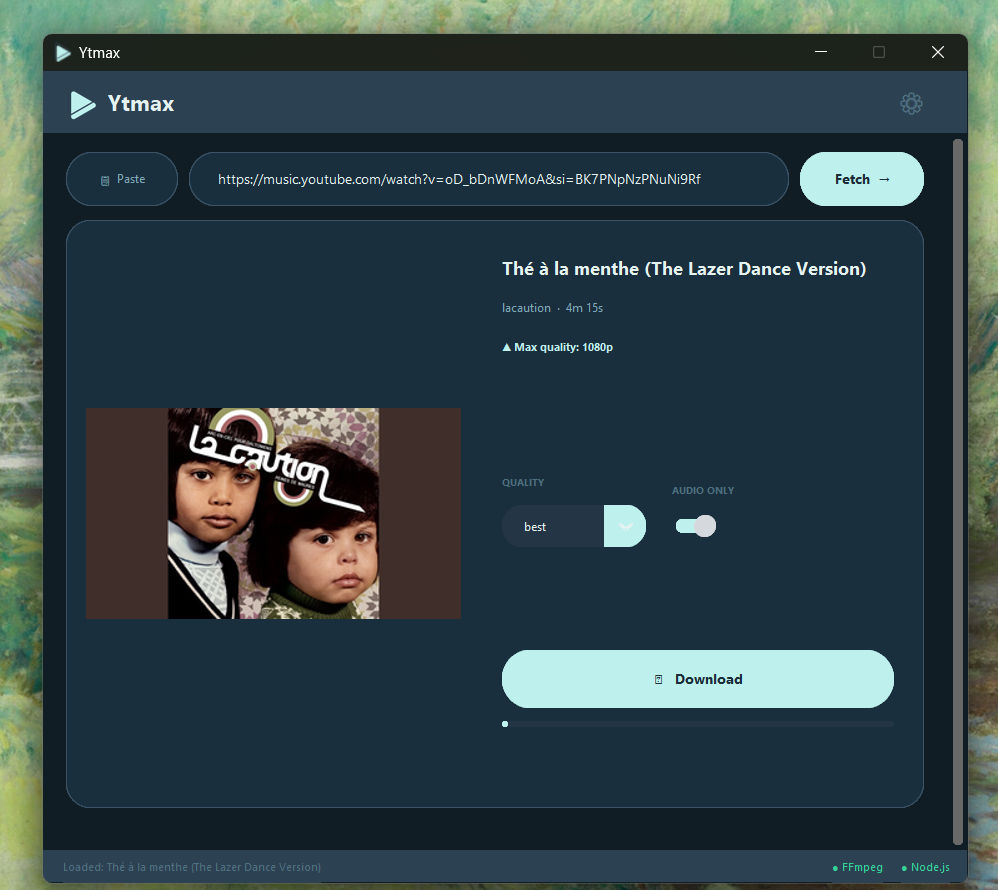
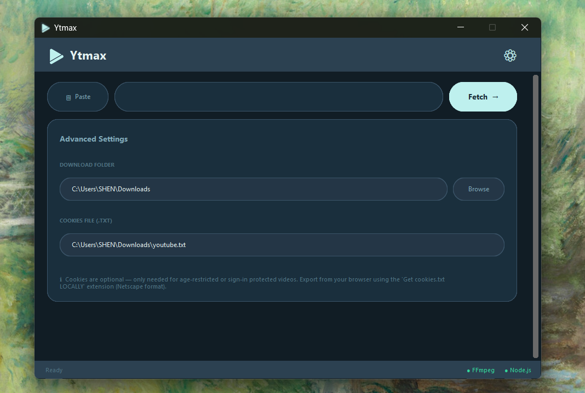

# YTmax



A modern, high performance desktop application for downloading 4K YouTube videos. Featuring a dynamic user interface powered by CustomTkinter, it effortlessly extracts advanced video qualities and bypasses various bot-checks by utilizing browser session cookies.

## Features

- **Pristine Quality Selection:** Downloads videos automatically in dynamic maximum resolution ranging from generic definitions up to **4K** based on what the video stream supports natively, or downloads pure audio. 
- **Modern User Interface:** Built using `customtkinter`, the app feels completely immersive, dark-themed, and responsive.
  
  
- **Node.js Engine Supported Extractors:** Bypass advanced streaming restrictions automatically internally formatted using the YoutubeDL parser running natively.
- **Cookie Authentication:** Supports loading exported `youtube.txt` browser cookies to reliably fetch age-restricted items or circumvent Google's automated sign-in checks gracefully.

## Prerequisites

- **Python 3.8+**
- **FFmpeg**: Must be globally installed on your system PATH for video + audio stream merging.
- **Node.js**: Must be globally installed to process advanced internal YouTube scraping engine requests.

**Windows Users (Quick Install):**
You can instantly install the required system dependencies using Windows Package Manager (`winget`):
```powershell
winget install -e --id Gyan.FFmpeg
winget install -e --id OpenJS.NodeJS
```

**Linux Users (Quick Install):**
Install the system dependencies via your package manager (example for Ubuntu/Debian):
```bash
sudo apt update
sudo apt install ffmpeg nodejs npm python3-tk
```

## Setup & Installation

1. **Clone the repository:**
   ```bash
   git clone https://github.com/shenfurkan/Ytmax.git
   cd Ytmax
   ```

2. **Install the necessary Python packages:**
   ```bash
   pip install -r requirements.txt
   ```
   *(Ensure you have `yt-dlp` and `customtkinter` properly referenced!)*

3. **Run the application:**
   - **Windows:** `python main.py`
   - **Linux:** `python3 main.py`


## Using Cookies (Bypassing Checks & Age-Restrictions)



You’ll need to use the cookie if the site asks whether you’re a robot or requires age verification.
1. Navigate to your browser and log into YouTube.
2. Use an extension like **Get cookies.txt LOCALLY** to export your active session cookie.
3. Rename the exported text file to `youtube.txt`.
4. Place this file inside your user's **Downloads** folder.
    - Windows: `C:\Users\<username>\Downloads\youtube.txt`
    - Linux: `~/Downloads/youtube.txt`

